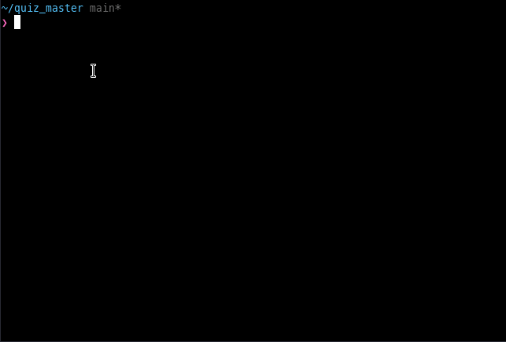

# Quiz Master

### Quiz master is simple game using golang interactive shell. 
 
 
 
## Installation Instructions
1. clone the repository

       git clone https://github.com/wawanrandianto1/Quiz-Master.git

2. install ginkgo executable under $GOBIN

       go install -mod=mod github.com/onsi/ginkgo/v2/ginkgo

   set bash command to $GOBIN

       echo 'export PATH="$HOME/go/bin:$PATH"' >> ~/.bash_profile

   renew bash command

       source ~/.bash_profile
  
3. run command, to compile the code

       bin/setup

4. last step, run command and enjoy the quiz

       bin/quiz_master

## How to play
- you can input question and answer the question, example:

> $ create_question 1 “How many letters are there in the English alphabet?” 26

> $ create_question 2 “How many vowels are there in the English alphabet?” 5

> $ answer_question 2 5

> Correct!

> $ exit

- see "help" command

